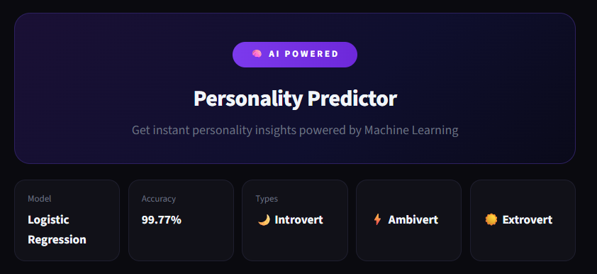
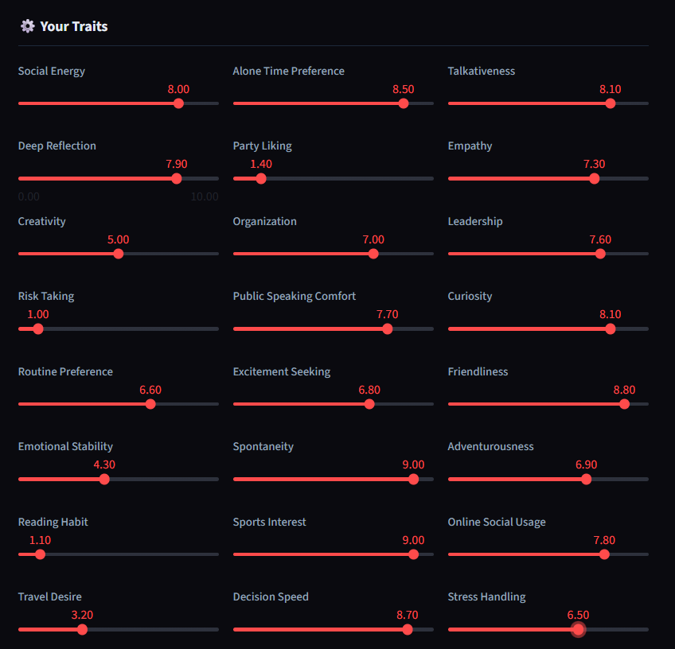
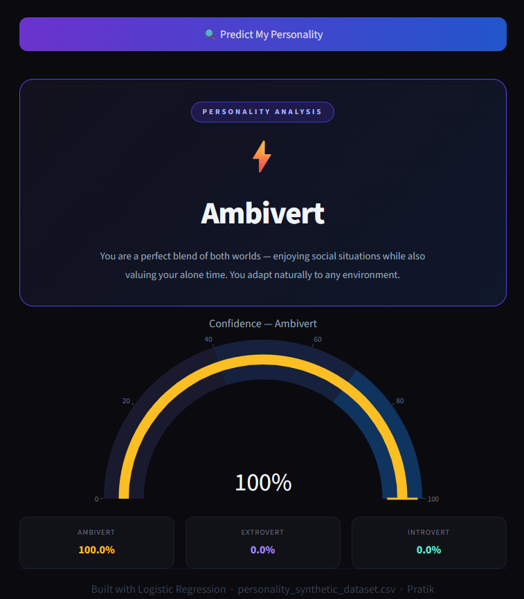

# 🧠 Personality Type Predictor

<div align="center">


**An AI-powered web app that predicts your personality type — Introvert, Extrovert, or Ambivert — using Logistic Regression with 99.77% accuracy.**

[🚀 Live Demo](#) · [📓 Notebook](#) · [📊 Dataset](#) · [🐛 Report Bug](#)

</div>

---

## 📸 App Preview

| Home Screen | Trait Sliders | Prediction Result |
|:-----------:|:-------------:|:-----------------:|
|  |  |  |

> *Add your own screenshots in a `/screenshots` folder after deployment*

---

## 🎯 Overview

This project uses **Logistic Regression** to classify personality types based on 24 behavioral and psychological traits. The interactive Streamlit UI allows users to adjust trait sliders and get instant predictions with a confidence gauge.

### 🔑 Key Highlights
- ✅ **99.77% accuracy** on test data
- ✅ 24 interactive personality trait sliders
- ✅ Real-time prediction with confidence breakdown (Introvert / Extrovert / Ambivert)
- ✅ Clean dark-themed UI built with Streamlit
- ✅ Pre-trained model saved as `.pkl` for fast inference

---

## 🧪 Features Used for Prediction

| Category | Features |
|----------|----------|
| **Social** | Social Energy, Talkativeness, Friendliness, Party Liking, Online Social Usage |
| **Cognitive** | Deep Reflection, Creativity, Curiosity, Reading Habit, Decision Speed |
| **Emotional** | Empathy, Emotional Stability, Stress Handling |
| **Behavioral** | Risk Taking, Spontaneity, Adventurousness, Travel Desire, Routine Preference |
| **Professional** | Leadership, Organization, Public Speaking Comfort |
| **Physical** | Sports Interest, Excitement Seeking, Alone Time Preference |

---

## 🛠️ Tech Stack

| Tool | Purpose |
|------|---------|
| **Python** | Core programming language |
| **Scikit-learn** | Logistic Regression model training & evaluation |
| **Streamlit** | Interactive web UI |
| **Pandas & NumPy** | Data manipulation |
| **Matplotlib & Seaborn** | EDA visualizations |
| **Pickle** | Model serialization |

---

## 📊 Model Performance

| Metric | Score |
|--------|-------|
| **Accuracy** | 99.77% |
| **Model** | Logistic Regression |
| **Classes** | Introvert · Ambivert · Extrovert |
| **Dataset** | personality_synthetic_dataset.csv |

---

## ⚙️ Project Structure

```
Personality-Type-Classifier/
│
├── ui.py                              # Streamlit web app
├── Model.ipynb                        # Jupyter Notebook (EDA + Training)
├── model.pkl                          # Saved trained model
├── personality_synthetic_dataset.csv  # Dataset
├── requirements.txt                   # Python dependencies
└── README.md                          # Project documentation
```

---

## 🚀 Run Locally

### 1. Clone the repository
```bash
git clone https://github.com/pkale9650-ai/Personality-Type-Classifier.git
cd Personality-Type-Classifier
```

### 2. Install dependencies
```bash
pip install -r requirements.txt
```

### 3. Launch the app
```bash
streamlit run ui.py
```

Open your browser and go to `http://localhost:8501`

---

## 📓 Notebook Workflow

The `Model.ipynb` notebook covers:

1. **Exploratory Data Analysis (EDA)** — distribution plots, correlation heatmap
2. **Data Preprocessing** — encoding, feature scaling
3. **Model Training** — Logistic Regression with Scikit-learn
4. **Evaluation** — Accuracy, Confusion Matrix, Classification Report
5. **Model Export** — saving as `model.pkl` using Pickle

---

## 🌐 Live Deployment

> 🔗 **[Click here to try the live app](#)**
> *(Deploy on Streamlit Cloud and update this link)*

### Deploy on Streamlit Cloud (Free)
1. Push this repo to GitHub
2. Go to [streamlit.io/cloud](https://streamlit.io/cloud)
3. Click **"New App"** → select this repo
4. Set main file as `ui.py`
5. Click **Deploy** 🎉

---

## 👤 Author

**Pratik Kale**

- 🔗 [LinkedIn](https://linkedin.com/in/your-profile)
- 🐙 [GitHub](https://github.com/pkale9650-ai)

---

## 📄 License

This project is open source and available under the [MIT License](LICENSE).

---

<div align="center">

⭐ **If you found this helpful, please star the repo!** ⭐

*Built with ❤️ by Pratik Kale | BTech AI & ML @ Vishwakarma University, Pune*

</div>
